# 🚀 Proyecto Dark Launch – Implementación de Feature Flags con Harness + Flask + Redis + Docker

## 📌 Introducción
Este proyecto implementa un flujo completo de **Dark Launch** utilizando:

- **Flask** como aplicación backend
- **Redis** como sistema de almacenamiento de estado
- **Harness Feature Flags** como proveedor de flags dinámicos
- **Docker Compose** para orquestación de servicios

El objetivo es demostrar:
- Activación/desactivación dinámica de features
- Targeting individual
- Segmentos/grupos de usuarios
- A/B testing basado en porcentaje
- Cambios en caliente sin redeploy

---

# Fase 1 – Entorno Dockerizado

### Comando para levantar el entorno:
```bash
docker-compose up --build
```

**Resultado esperado**:
- Redis inicializado correctamente
- Flask corriendo en el puerto 5000
- Conexión exitosa a Harness

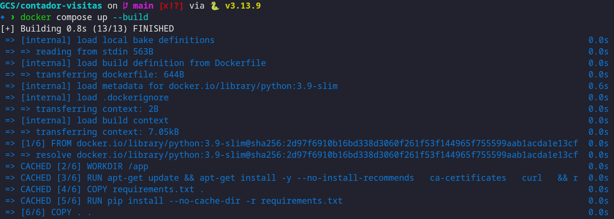
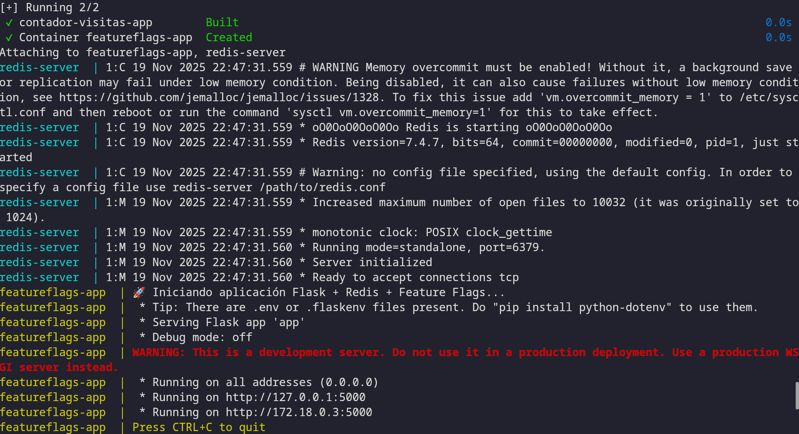

# Fase 2 – Health Check del Sistema
## Pagina principal con Flag Off en Harness
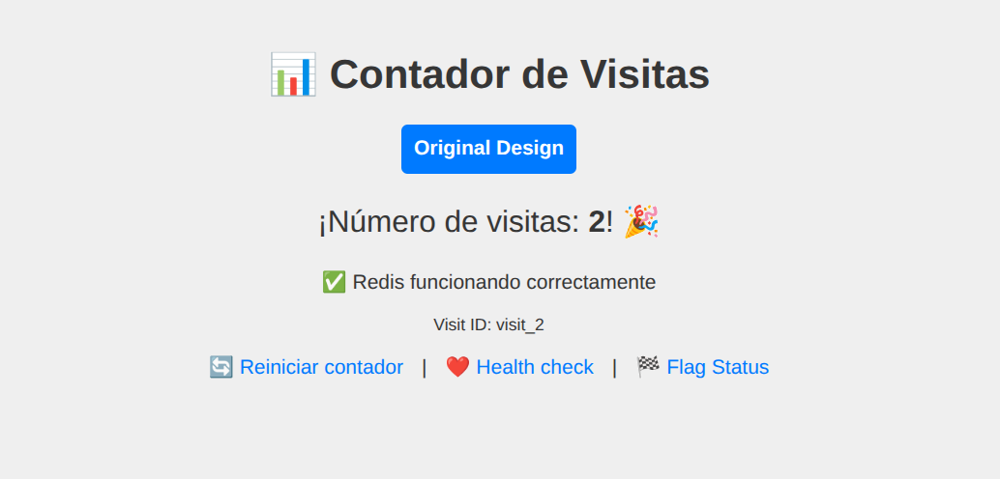


# Fase 3 – Configuración del Feature Flag en Harness
## 3.1 Targets definidos en Target Management
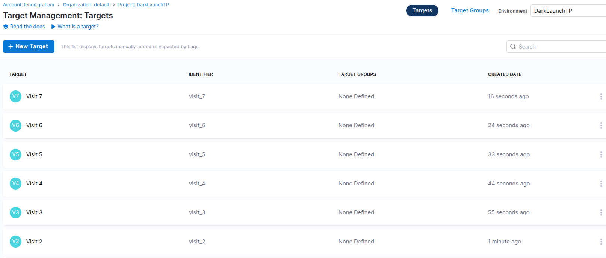

## 3.2 Individual Targeting — Visitas 2 y 4
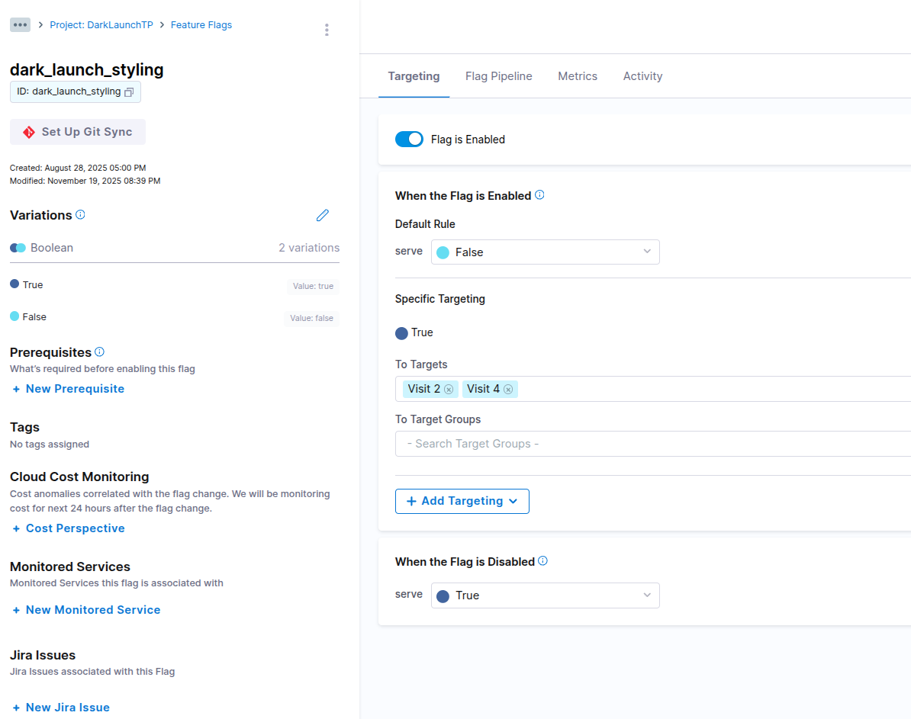
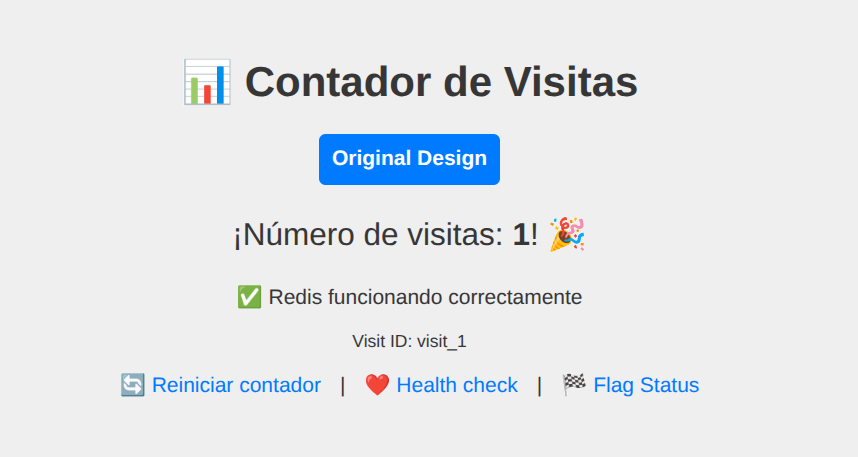
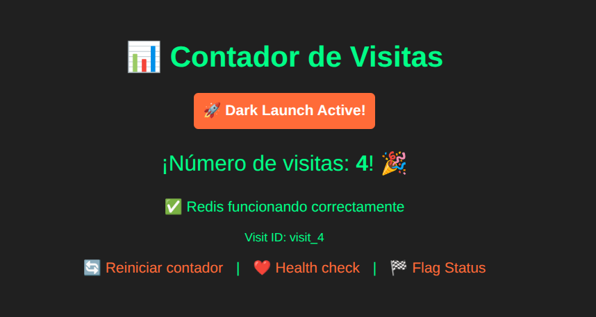

## 3.4 Segmentos — Visitas 5, 6 y 7
**Segment Group**:
- Nombre: high_visits
- Targets: visit_5, visit_6, visit_7

**Regla**:
- Serve → True (por grupo)

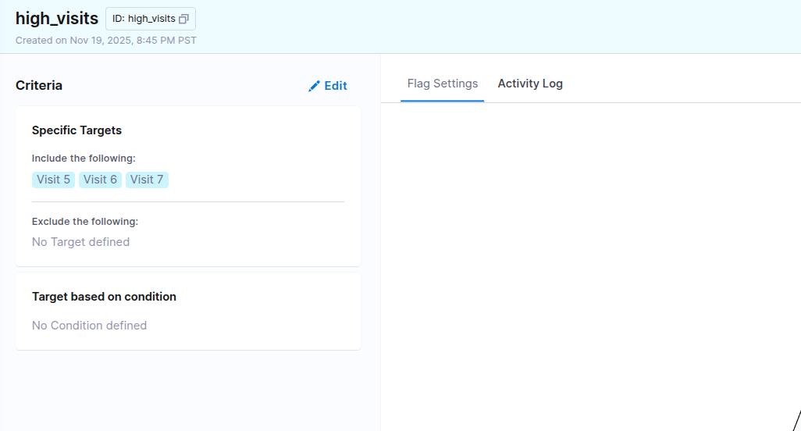
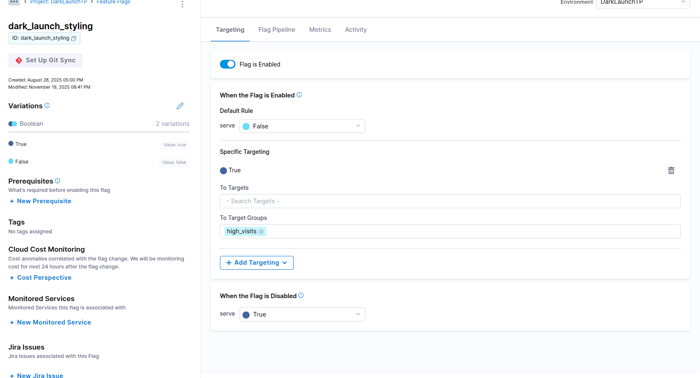
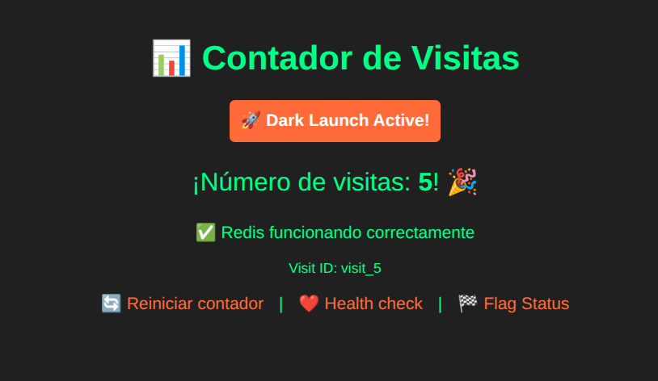


## 3.5 A/B Testing — Rollout del 30%
**Configuración**:
- Percentage Rollout:
    - True: 30%
    - False: 70%
- Hash: identifier (por defecto)

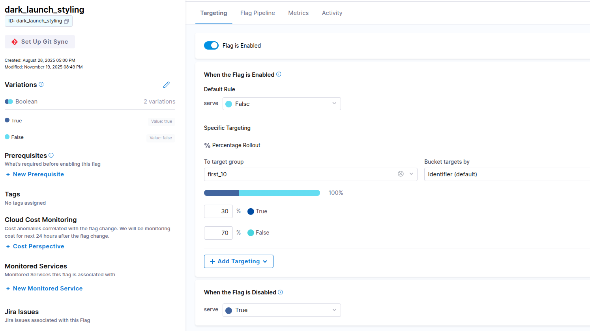
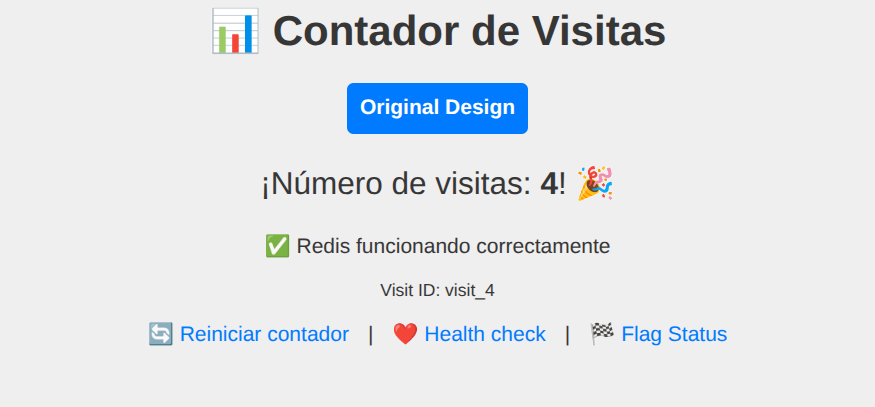
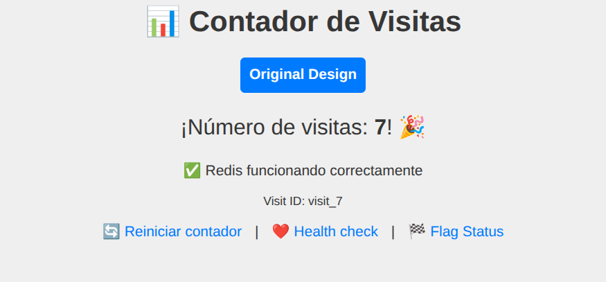


