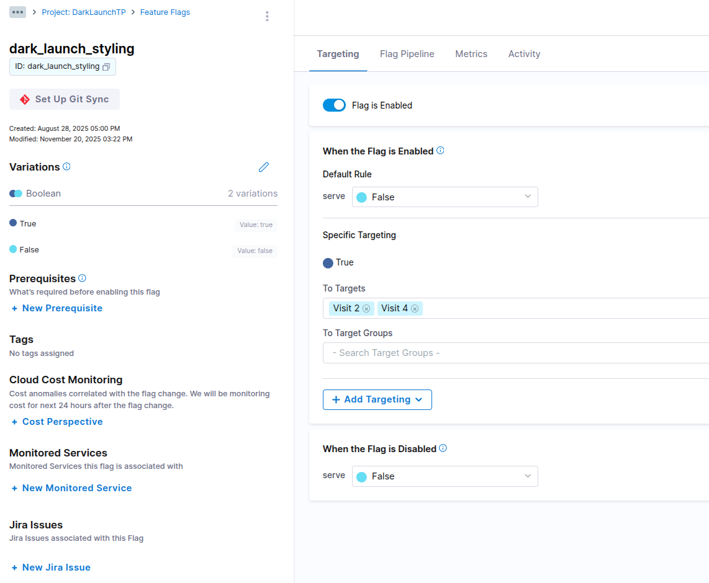
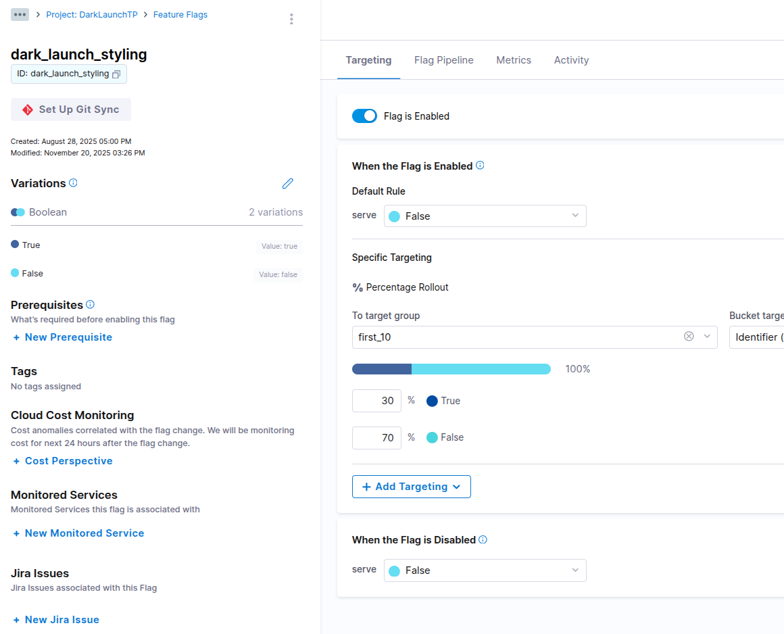

# 🚀 Proyecto Dark Launch – Implementación de Feature Flags con Harness + Flask + Redis + Docker
## 🧠 ¿Qué es un Feature Flag?

Un **Feature Flag** es un interruptor lógico que permite **activar o desactivar una funcionalidad** sin necesidad de modificar el código ni realizar un redeploy.  
Permite controlar el comportamiento de la aplicación en tiempo real

**Ventajas:**
- Despliegues seguros sin riesgo
- Activación progresiva de features
- Testing en producción sin afectar a todos los usuarios
- Rollbacks instantáneos

---

## 🕶️ ¿Qué es un Dark Launch?

Un **Dark Launch** es una técnica donde una nueva funcionalidad se **ejecuta en producción pero permanece oculta al usuario final**, o solo es visible para un subconjunto específico.  
Se utiliza para verificar estabilidad, performance y compatibilidad antes de publicarla de manera general.

**Ejemplo en este proyecto:**
- El diseño oscuro (dark mode) solo se muestra si el flag está activo.
- El usuario común sigue viendo el diseño original.
- La funcionalidad nueva se puede activar/desactivar sin reiniciar la app.

---

## 🚀 ¿Cómo funciona todo esto con Harness?

Harness Feature Flags es la plataforma que permite:

1. **Crear el Feature Flag** (`dark_launch_styling`)
2. **Definir reglas de targeting:**
   - Individual (visit_2, visit_4)
   - Segmentos (visit_5, visit_6, visit_7)
   - A/B Testing por porcentaje (30%)
3. **Cambiar el estado del flag en tiempo real**
4. **Transmitir estos cambios a la app sin necesidad de redeploy**

Harness envía al SDK (tu app Flask) el valor del flag cada vez que se hace una request.

---

## 🧩 ¿Cómo lo implementamos en Flask?

En cada visita, tu aplicación:

1. Incrementa un contador en **Redis**
2. Genera un identificador dinámico:  
   `visit_1`, `visit_2`, `visit_3`, …
3. Construye un **Target Harness** basado en esa visita:
   ```python
   target = Target(
       identifier=f"visit_{visitas}",
       name=f"Visit {visitas}",
       attributes={"visit_count": visitas}
   )

## 📌 Introducción
Este proyecto implementa un flujo completo de **Dark Launch** utilizando:

- **Flask** como aplicación backend
- **Redis** como sistema de almacenamiento de estado
- **Harness Feature Flags** como proveedor de flags dinámicos
- **Docker Compose** para orquestación de servicios

El objetivo es demostrar:
- Activación/desactivación dinámica de features
- Targeting individual
- Segmentos/grupos de usuarios
- A/B testing basado en porcentaje
- Cambios en caliente sin redeploy

---

# Fase 1 – Entorno Dockerizado

### Comando para levantar el entorno:
```bash
docker-compose up --build
```

**Resultado esperado**:
- Redis inicializado correctamente
- Flask corriendo en el puerto 5000
- Conexión exitosa a Harness


# Fase 2 – Health Check del Sistema
## Pagina principal con Flag Off en Harness
<div style="text-align:center">


</div>

# Fase 3 – Configuración del Feature Flag en Harness


## 3.1 Targets definidos en Target Management


## 3.2 Individual Targeting — Visitas 2 y 4

### ✔ When the flag is ENABLED → Default rule = False
- El flag “ON” habilita el dark launch solo para los targetings
- El resto ve el estilo original

### ✔ When the flag is DISABLED → Default rule = False
- Es decir:
- Flag OFF → NO dark launch para nadie
- Todos deben ver el estilo original (baseline)

<div style="text-align:center">
    
</div>

<div style="text-align:center">
    
    
</div>

## 3.4 Segmentos — Visitas 5, 6 y 7
**Segment Group**:
- Nombre: high_visits
- Targets: visit_5, visit_6, visit_7

**Regla**:
- Serve → True (por grupo)

<div style="text-align:center">
    
    
</div>

<div style="text-align:center">
    
    
</div>

## 3.5 A/B Testing — Rollout del 30%
**Configuración**:
- Percentage Rollout:
    - True: 30%
    - False: 70%
- Hash: identifier (por defecto)

<div style="text-align:center">
    
</div>
<div style="text-align:center">
    
    
    
</div>


